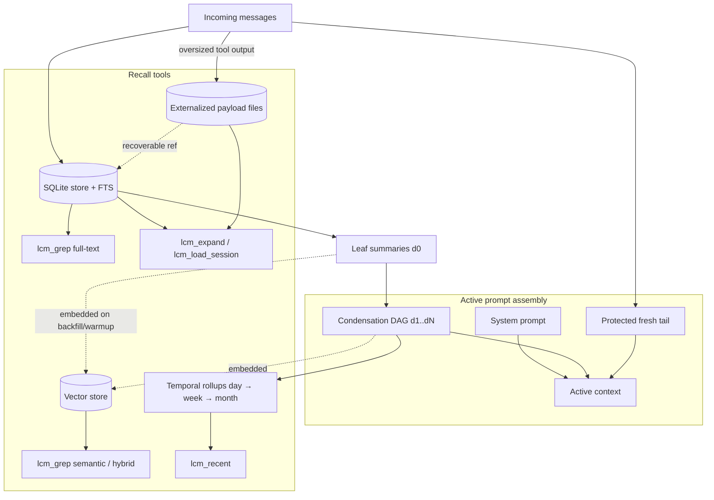
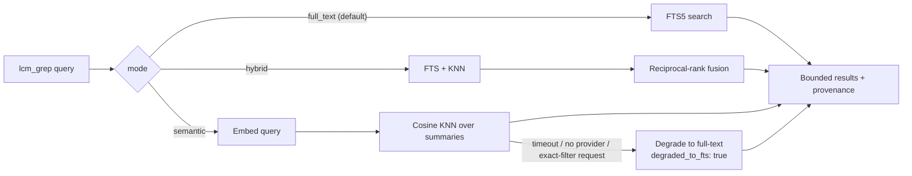

# Feature overview — memory, retrieval, and context-budget features

This page is the human-readable map of the `hermes-lcm` feature surface: what
each feature family does, why it exists, and which switch turns it on. For
exact install/config detail see the [Operator guide](operator-guide.md); for
tool contracts see the [Retrieval tools reference](retrieval-tools.md); for
embedding provider setup see [Embeddings setup](embeddings-setup.md).

**Every feature below ships default-off.** A stock install behaves exactly
like the previous release until an operator opts in with an environment
variable, and each family keeps its data out of the core schema until first
use, so a disabled install stays readable by older builds.

## The one-paragraph mental model

LCM persists every message in a plugin-local SQLite store, compacts older
context into a hierarchical summary DAG, and rebuilds the active prompt from
the best summaries plus a protected fresh tail. Everything else on this page
is one of three upgrades to that loop: **spending fewer tokens on giant tool
outputs** (externalization), **organizing memory by time** (temporal rollups),
or **finding things by meaning instead of keywords** (embeddings).

## Family 1 — Large-output externalization and context-budget controls

**The problem it solves:** agents that run builds, tests, crawls, or searches
receive tool results that are 10–100× larger than any conversational turn. A
single 30K-token test log can crowd a week of useful memory out of the active
prompt, and its bytes get duplicated into every SQLite backup and WAL file.

| Feature | What you get | Why it matters |
|---|---|---|
| Large-output externalization | Oversized tool/media/raw payloads move to plugin-managed JSON files with stable refs | `lcm.db`, FTS tables, and backups stop duplicating megabytes of tool noise |
| Active-replay stubbing | Token-heavy textual tool results are replaced in the provider-visible prompt with recoverable refs — including inside the fresh tail | The model stops re-reading a 30K-token log on every turn; recovery stays one `lcm_expand(externalized_ref=...)` away |
| Historical backfill (dry-run first) | Old sessions' already-stored giant outputs can be externalized after the fact | Existing bloated databases get the same relief as new traffic |
| Externalized payload search | `lcm_grep(content_scope='externalized'\|'both')` searches payload prefixes, bounded (≤256 files, ≤512KB scanned per file) | "Which run printed that error?" works even after the output left the prompt |
| Fresh-tail token cap | `LCM_FRESH_TAIL_MAX_TOKENS` caps the protected tail by tokens, not just message count | One giant recent tool result can no longer pin the whole budget; complete assistant/tool groups are always kept intact |
| Threshold full sweep | At threshold, one synchronous bounded sweep drains chunked raw backlog before publishing a single new prefix | Long-idle sessions catch up in one pass instead of thrashing repeated compactions |

Failure posture: externalization is fail-open (if a write fails, the provider
still receives the original inline payload — nothing is dropped), and every
replaced payload keeps a lossless recovery path via its ref.

Key switches: `LCM_LARGE_OUTPUT_EXTERNALIZATION_ENABLED`,
`LCM_LARGE_OUTPUT_ACTIVE_REPLAY_STUBBING_ENABLED` (+ threshold vars),
`LCM_FRESH_TAIL_MAX_TOKENS`, `LCM_THRESHOLD_FULL_SWEEP_ENABLED`.
Full table: [Operator guide → Configuration](operator-guide.md#configuration).

## Family 2 — Temporal memory (rollups + `lcm_recent`)

**The problem it solves:** a summary DAG is organized by compaction order, not
by calendar. "What did we work on last week?" used to mean grepping and
paging. Agents that live for weeks need time-indexed memory.

| Feature | What you get | Why it matters |
|---|---|---|
| Temporal rollup store | Durable day/week/month rollup rows with build leases, generations, and crash-safe invalidation | Time-indexed memory that survives crashes, races, and purges without serving stale content |
| Rollup builder | Bounded maintenance passes build rollups from the DAG; publication of a new summary stales every covered day | Rollups stay current without ever blocking the interactive turn |
| `lcm_recent` tool | "Recent memory" by natural UTC period (`today`, `this week`, ...) served from ready rollups | One call answers "catch me up" with provenance; no grep+expand chain |
| Transparent fallback | Missing/stale/disabled rollups fall back to time-bounded leaf summaries | The tool contract holds from day one — enabling rollups is an optimization, not a migration |
| Operator introspection | `/lcm rollups` status + `rebuild` with transactional multi-target seeding and truthful partial status | Operators can see and repair temporal state; interrupted rebuilds never silently lose queued work |

Integrity posture (this family survived an adversarial review cycle focused
on exactly these seams): build tokens carry non-reusable nonces, late or
superseded builders cannot overwrite newer state, deleted sources stale every
covered period, and multi-target rebuild seeding is atomic.

Key switches: `LCM_TEMPORAL_ROLLUPS_ENABLED` (+ `LCM_ROLLUP_*` tuning).

## Family 3 — Semantic retrieval (embeddings + hybrid search)

**The problem it solves:** FTS5 finds exact words. Agents ask "have we
discussed database migration strategy?" and the transcript says "schema
versioning plan". Keyword search misses it; semantic search doesn't.

| Feature | What you get | Why it matters |
|---|---|---|
| Vector store substrate | SQLite-backed embedding storage keyed by canonical provider identity, with benchmark-chosen KNN ladder | Switching models/providers can never silently mix incompatible vectors |
| Pluggable providers | `voyage` (cloud, free tier), `ollama` (local server), `fastembed` (fully local, ONNX) | Zero-cost local privacy or best-quality cloud — same config surface |
| Explicit warmup | `/lcm embed warmup` resolves, dimension-locks, and registers the profile | Model downloads and dimension surprises happen at setup time, never mid-conversation |
| Backfill (dry-run first) | `/lcm embed backfill` estimates cost/coverage before `--apply`; leased, crash-safe, truthful status | Embedding an existing archive is a deliberate, budgeted, resumable operation |
| Semantic + hybrid `lcm_grep` | `mode='semantic'` (KNN over summaries) and `mode='hybrid'` (RRF fusion with full-text) | Meaning-based recall with the exact-match safety net, one absolute latency budget, graceful degrade to full-text |
| Committed recall eval | A committed evaluation exercises recall quality | Retrieval quality is a tested contract, not a vibe |

Safety posture: `mode='full_text'` remains the byte-compatible default;
semantic timeouts degrade to full-text with an explicit `degraded_to_fts`
marker; filters that the semantic arm cannot honor exactly cause a degrade
rather than approximate results; source-lineage checks fail closed.

Key switches: `LCM_EMBEDDINGS_ENABLED`, `LCM_EMBEDDING_PROVIDER`,
`LCM_EMBEDDING_MODEL` (+ timeouts). Setup walkthrough:
[Embeddings setup](embeddings-setup.md).

### Choosing an embedding provider

| | `voyage` | `ollama` | `fastembed` |
|---|---|---|---|
| Runs where | Voyage AI cloud | Your Ollama server | In-process (ONNX, CPU) |
| Cost | **200M tokens free** (voyage-4 family; no credit card), then from $0.02/M | Free | Free |
| Setup | API key only | Ollama install + model pull | Optional `fastembed` pip install; ~90–130 MB model download at warmup |
| Quality | Highest (frontier embedding models) | Model-dependent | Solid small-model baseline (`BAAI/bge-small-en-v1.5`, `all-MiniLM-L6-v2`) |
| Privacy | Summaries leave the machine | Fully local | Fully local |

**The Voyage free tier is generous for this workload.** LCM embeds bounded
summaries, not raw transcripts — a heavy month of agent use is typically a few
million tokens, so 200M free tokens covers initial backfill plus years of
queries. The same free account also includes **200M free reranker tokens**
(`rerank-2.5` at $0.05/M and `rerank-2.5-lite` at $0.02/M after) — LCM's hybrid
mode currently fuses with RRF and does not call an external reranker, but the
key you set up today already unlocks one for tools that use it, and it is the
natural next enhancement for hybrid retrieval here.

**Pairing note for code-search users:** if you already run a Voyage-backed
code-graph tool (for example GitNexus, which uses `voyage-code-3` embeddings
and `rerank-2.5` reranking in its premium mode, and a small local ONNX model —
`snowflake-arctic-embed-xs` — in its default mode), one `VOYAGE_API_KEY`
serves both: code search and agent memory draw from the same free allocation,
and the fully-local pairing (`fastembed` here, the built-in ONNX model there)
keeps both features offline with zero shared setup.

## How the families compose

Each family is independent — enable any subset. Together they turn LCM from a
compression layer into a memory system:

- externalization keeps the **budget** honest,
- rollups organize memory by **time**,
- embeddings organize it by **meaning**,
- and the existing DAG + lossless store keep every byte **recoverable**.

Ready-made env profiles per agent type live in
[Agent configuration profiles](agent-config-profiles.md).

## Where these features came from

The feature families landed as reviewed PR trains with anchor issues
describing the design space: temporal memory
([#385](https://github.com/stephenschoettler/hermes-lcm/issues/385), PRs
[#387](https://github.com/stephenschoettler/hermes-lcm/pull/387)–[#391](https://github.com/stephenschoettler/hermes-lcm/pull/391))
and embeddings
([#386](https://github.com/stephenschoettler/hermes-lcm/issues/386), PRs
[#390](https://github.com/stephenschoettler/hermes-lcm/pull/390)–[#395](https://github.com/stephenschoettler/hermes-lcm/pull/395)),
plus the externalization/context-budget set (PRs
[#380](https://github.com/stephenschoettler/hermes-lcm/pull/380)–[#384](https://github.com/stephenschoettler/hermes-lcm/pull/384)).
The benchmark numbers behind the KNN ladder and the adversarial-review
hardening notes are recorded in those threads.
